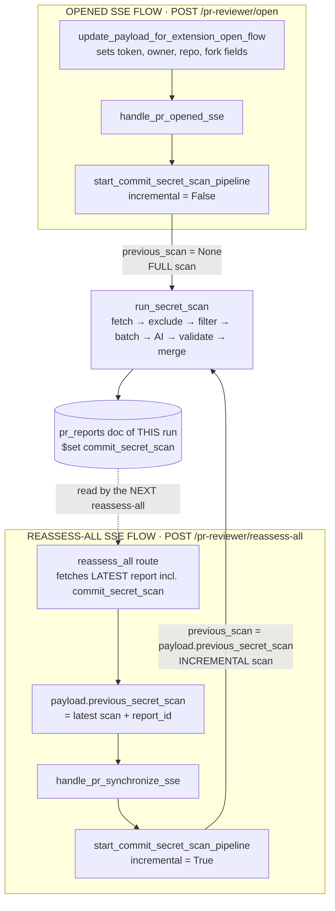
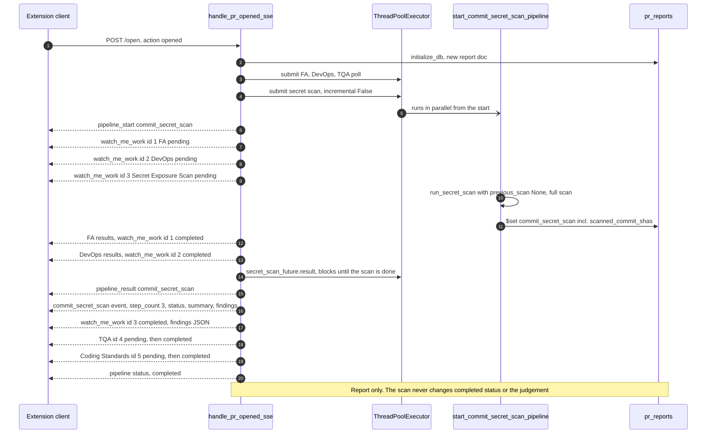

## 1. Overview: both flows share one scanner

```mermaid
flowchart TB
    subgraph OPEN["OPENED SSE FLOW · POST /pr-reviewer/open"]
        O1["update_payload_for_extension_open_flow<br/>sets token, owner, repo, fork fields"]
        O2["handle_pr_opened_sse"]
        O3["start_commit_secret_scan_pipeline<br/>incremental = False"]
        O1 --> O2 --> O3
    end

    subgraph REASSESS["REASSESS-ALL SSE FLOW · POST /pr-reviewer/reassess-all"]
        R1["reassess_all route<br/>fetches LATEST report incl. commit_secret_scan"]
        R2["payload.previous_secret_scan<br/>= latest scan + report_id"]
        R3["handle_pr_synchronize_sse"]
        R4["start_commit_secret_scan_pipeline<br/>incremental = True"]
        R1 --> R2 --> R3 --> R4
    end

    O3 -->|"previous_scan = None<br/>FULL scan"| SCAN
    R4 -->|"previous_scan = payload.previous_secret_scan<br/>INCREMENTAL scan"| SCAN

    SCAN["run_secret_scan<br/>fetch → exclude → filter → batch → AI → validate → merge"]
    SCAN --> DB[("pr_reports doc of THIS run<br/>$set commit_secret_scan")]
    DB -.->|"read by the NEXT reassess-all"| R1

```

## 2. Opened SSE flow: when the scan runs and the order of its events

```mermaid
sequenceDiagram
    autonumber
    participant C as Extension client
    participant H as handle_pr_opened_sse
    participant EX as ThreadPoolExecutor
    participant S as start_commit_secret_scan_pipeline
    participant DB as pr_reports

    C->>H: POST /open, action opened
    H->>DB: initialize_db, new report doc
    H->>EX: submit FA, DevOps, TQA poll
    H->>EX: submit secret scan, incremental False
    EX-)S: runs in parallel from the start
    H-->>C: pipeline_start commit_secret_scan
    H-->>C: watch_me_work id 1 FA pending
    H-->>C: watch_me_work id 2 DevOps pending
    H-->>C: watch_me_work id 3 Secret Exposure Scan pending
    S->>S: run_secret_scan with previous_scan None, full scan
    S->>DB: $set commit_secret_scan incl. scanned_commit_shas
    H-->>C: FA results, watch_me_work id 1 completed
    H-->>C: DevOps results, watch_me_work id 2 completed
    H->>EX: secret_scan_future.result, blocks until the scan is done
    H-->>C: pipeline_result commit_secret_scan
    H-->>C: commit_secret_scan event, step_count 3, status, summary, findings
    H-->>C: watch_me_work id 3 completed, findings JSON
    H-->>C: TQA id 4 pending, then completed
    H-->>C: Coding Standards id 5 pending, then completed
    H-->>C: pipeline status, completed
    Note over H,DB: Report only. The scan never changes completed status or the judgement


```

## 3. Reassess-all SSE flow: route, handler, sync pipeline and fallback

```mermaid
flowchart TB
    A["POST /pr-reviewer/reassess-all<br/>headers X-Github-Token, Guidelines-Token<br/>body base_branch, head_branch, head_repo_url,<br/>base_repo_url, is_forked_repo, session_id ..."]
    A --> V1{"required params present?"}
    V1 -->|no| E400a["SSE error 400"]
    V1 -->|yes| V2{"session already running?"}
    V2 -->|yes| E409a["SSE error 409"]
    V2 -->|no| L["build pr_url, fork aware<br/>take lock sync_validation_lock:pr_url"]
    L -->|lock held| E409b["SSE error 409"]
    L --> HEAD["current_head_sha = get_latest_commit_sha"]
    HEAD --> GET["get_latest_report_from_pr_url with projection:<br/>_id, commits, completed, has_error,<br/>commit_secret_scan.scanned_commit_shas,<br/>.commits.commit_sha, .commits.batch_ids,<br/>.batches.batch_id, .batches.status,<br/>.skipped_commits, .findings"]
    GET --> V3{"report exists, completed,<br/>no error, base/head known,<br/>head changed?"}
    V3 -->|no| E4xx["SSE error 400 / 404<br/>lock released"]
    V3 -->|yes| P["update_payload_for_extension_sync_flow"]
    P --> PS{"latest report has commit_secret_scan?"}
    PS -->|yes| PS1["payload.previous_secret_scan =<br/>scan + report_id"]
    PS -->|no| PS2["payload.previous_secret_scan = empty<br/>→ full scan"]
    PS1 --> RUN
    PS2 --> RUN
    RUN["start heartbeat + pipeline_runner threads<br/>stream events via Redis, resumable through /open"]

    RUN --> H1["handle_pr_synchronize_sse<br/>initialize_db → NEW report doc for this run<br/>3 x github_compare_changes"]
    H1 --> H2{"sync still valid?<br/>PR inside window?"}
    H2 -->|no| HX["return / skipped"]
    H2 -->|yes| H3["sync_pipeline = PRReviewSyncPipeline"]
    H3 --> H4["secret_scan_executor = ThreadPoolExecutor 1<br/>sync_pipeline.secret_scan_future = submit<br/>start_commit_secret_scan_pipeline incremental True<br/>sync_pipeline.secret_scan_emitted = False"]
    H4 --> H5["yield pipeline_start commit_secret_scan"]
    H4 -. "runs in parallel" .-> SCANBOX["SCAN THREAD<br/>run_secret_scan with previous_scan<br/>→ $set commit_secret_scan on the new doc"]

    H5 --> SP
    subgraph SP["start_pr_review_sync_pipeline_sse"]
        S0{"existing PR data?<br/>empty net diff raises here"}
        S0 -->|yes| S1["watch_me_work id 1 FA pending<br/>submit FA sync + DevOps<br/>handle_changed_files, TQA work"]
        S1 --> S2["FA results, id 1 completed"]
        S2 --> S3["DevOps pending, id 2"]
        S3 --> S4["secret_scan_pending_event, id 3 pending"]
        S4 --> S5["DevOps results, id 2 completed"]
        S5 --> S6["secret_scan_result_events<br/>waits on future.result<br/>pipeline_result, commit_secret_scan step_count 3,<br/>watch_me_work id 3 completed<br/>secret_scan_emitted = True"]
        S6 --> S7["TQA pending id 4, file_summaries,<br/>overall_summary step_count 4"]
        S7 --> S8["CS work, coding_standards event"]
        S0 -->|"no → exception"| SE["internal_error<br/>watch_me_work id 6 error step"]
    end

    S8 --> H6["handler: insert_to_db<br/>tqa_assessment, id 4 completed<br/>CS id 5 pending, compliance step_count 5, id 5 completed<br/>Event Report Link, emails, judgement"]
    SE --> H6
    H6 --> FB{"secret_scan_emitted?"}
    FB -->|yes| NOOP["fallback is a no-op"]
    FB -->|"no: empty diff / early error"| FB2["secret_scan_result_events<br/>emitted here instead, once"]
    NOOP --> OK["yield success"]
    FB2 --> OK
    OK --> FIN["finally: secret_scan_executor.shutdown wait False<br/>upload debug zip<br/>route releases lock"]
    SCANBOX -.->|"future result"| S6
    SCANBOX -.->|"future result"| FB2


```

