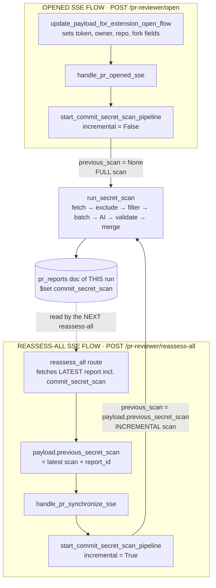

## 1. Overview: both flows share one scanner

```mermaid
flowchart TB
    subgraph OPEN["OPENED SSE FLOW · POST /pr-reviewer/open"]
        O1["update_payload_for_extension_open_flow<br/>sets token, owner, repo, fork fields"]
        O2["handle_pr_opened_sse"]
        O3["start_commit_secret_scan_pipeline<br/>incremental = False"]
        O1 --> O2 --> O3
    end

    subgraph REASSESS["REASSESS-ALL SSE FLOW · POST /pr-reviewer/reassess-all"]
        R1["reassess_all route<br/>fetches LATEST report incl. commit_secret_scan"]
        R2["payload.previous_secret_scan<br/>= latest scan + report_id"]
        R3["handle_pr_synchronize_sse"]
        R4["start_commit_secret_scan_pipeline<br/>incremental = True"]
        R1 --> R2 --> R3 --> R4
    end

    O3 -->|"previous_scan = None<br/>FULL scan"| SCAN
    R4 -->|"previous_scan = payload.previous_secret_scan<br/>INCREMENTAL scan"| SCAN

    SCAN["run_secret_scan<br/>fetch → exclude → filter → batch → AI → validate → merge"]
    SCAN --> DB[("pr_reports doc of THIS run<br/>$set commit_secret_scan")]
    DB -.->|"read by the NEXT reassess-all"| R1

```

